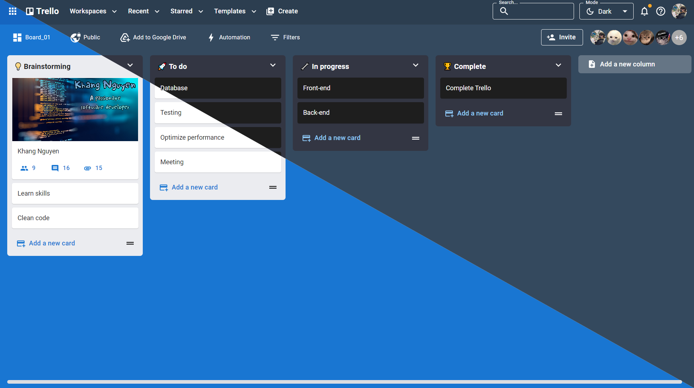

# Trello Clone

This project is a practical web application designed to mimic the functionality of Trello, providing users with a powerful tool for managing tasks and projects.



## Backend Part

[Trello API (Backend)](https://github.com/Kudoo39/trello-api)

## Table of Contents

1. [Getting Started](#getting-started)
2. [Features](#features)
3. [Technologies Used](#technologies-used)
4. [Project Structure](#project-structure)

## Getting Started

### Prerequisites

- Node.js (version 18.17.1 or higher recommended)
- npm or yarn

### Installation

To get started with this project, follow these steps:

1. Clone the repository: `git clone https://github.com/Kudoo39/trello-project`
2. Navigate to the project directory: `cd trello-project`
3. Install dependencies: `npm install` or `yarn install`
4. Run the app locally: `npm run dev` or `yarn dev`

## Features

- **List Management:** Add, remove, and rearrange lists within a board.
- **Card Management:** Create, edit, and delete cards within lists for detailed task tracking.
- **Drag-and-Drop Interface:** Intuitive drag-and-drop functionality for seamless organization.
- **Responsive Design:** A responsive and user-friendly interface for optimal user experience.

## Technologies Used

- **Frontend:**
  - JavaScript
  - React
  - Material-UI
  - dnd-kit (for drag-and-drop functionality)

## Project Structure

```
src
 ┣ apis
 ┃ ┣ index.js
 ┃ ┗ mock_data.js
 ┣ assets
 ┃ ┣ react.svg
 ┃ ┣ trello-blue.svg
 ┃ ┗ trello.svg
 ┣ components
 ┃ ┣ AppBar
 ┃ ┃ ┣ Menus
 ┃ ┃ ┃ ┣ Profiles.jsx
 ┃ ┃ ┃ ┣ Recent.jsx
 ┃ ┃ ┃ ┣ Starred.jsx
 ┃ ┃ ┃ ┣ Templates.jsx
 ┃ ┃ ┃ ┗ Workspaces.jsx
 ┃ ┃ ┗ AppBar.jsx
 ┃ ┗ ModeSelect
 ┃ ┃ ┗ ModeSelect.jsx
 ┣ customHooks
 ┃ ┗ index.js
 ┣ customLibs
 ┃ ┗ DndKitSensors.js
 ┣ pages
 ┃ ┣ Auth
 ┃ ┃ ┗ index.jsx
 ┃ ┣ Boards
 ┃ ┃ ┣ BoardBar
 ┃ ┃ ┃ ┗ BoardBar.jsx
 ┃ ┃ ┣ BoardContent
 ┃ ┃ ┃ ┣ ListColumns
 ┃ ┃ ┃ ┃ ┣ Column
 ┃ ┃ ┃ ┃ ┃ ┣ ListCards
 ┃ ┃ ┃ ┃ ┃ ┃ ┣ Card
 ┃ ┃ ┃ ┃ ┃ ┃ ┃ ┗ Card.jsx
 ┃ ┃ ┃ ┃ ┃ ┃ ┗ ListCards.jsx
 ┃ ┃ ┃ ┃ ┃ ┗ Column.jsx
 ┃ ┃ ┃ ┃ ┗ ListColumns.jsx
 ┃ ┃ ┃ ┗ BoardContent.jsx
 ┃ ┃ ┣ index.jsx
 ┃ ┃ ┗ _id.jsx
 ┃ ┗ Users
 ┃ ┃ ┣ index.jsx
 ┃ ┃ ┗ _id.jsx
 ┣ redux
 ┃ ┗ store.js
 ┣ utils
 ┃ ┣ constants.js
 ┃ ┣ formatters.js
 ┃ ┣ handleFutureFeature.js
 ┃ ┗ sorts.js
 ┣ App.jsx
 ┣ main.jsx
 ┗ theme.js
 ```

